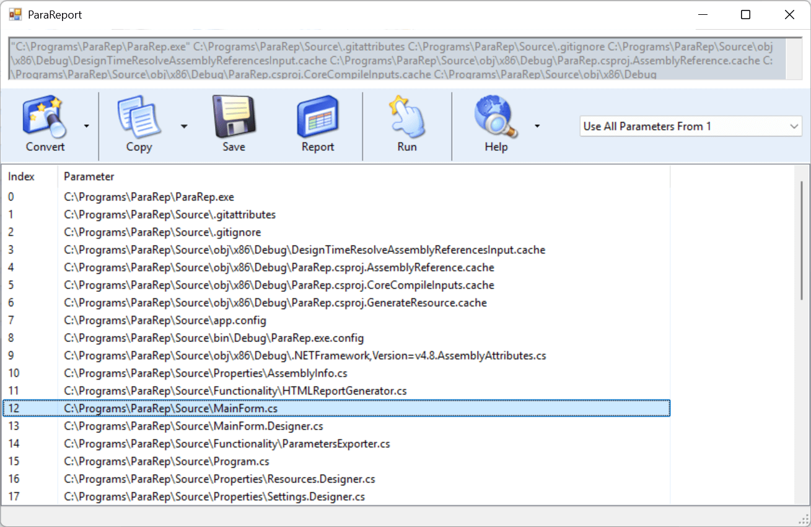

# ParaRep

ParaRep is an unfinished utility for analyzing command-line arguments passed to applications on Windows. Originally developed in 2012, this legacy application is built on the .NET Framework and provides a graphical user interface for inspecting and manipulating parameters. While rough around the edges, ParaRep offers core features that allow users to view the arguments, modify them in basic ways (such as extracting file names or extensions), and generate HTML reports that include both the parameters and relevant environment variables.

This project is currently in an early, unpolished state and would benefit greatly from modernization. I encourage contributions to help bring ParaRep to the current open-source .NET, enhance its capabilities, and improve its user interface and overall usability.

